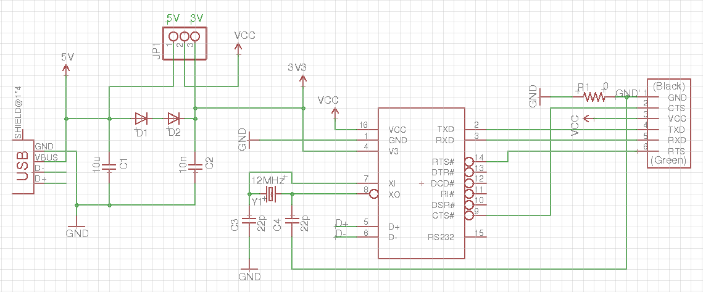
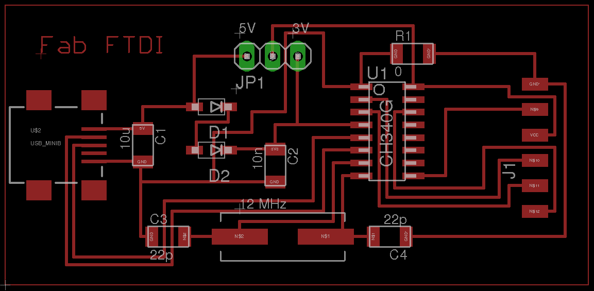
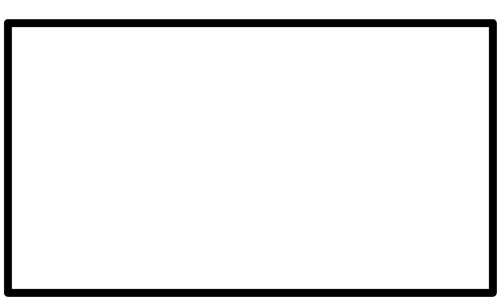
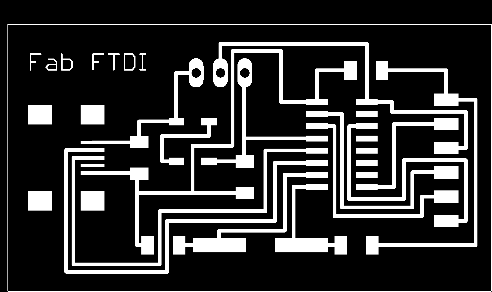
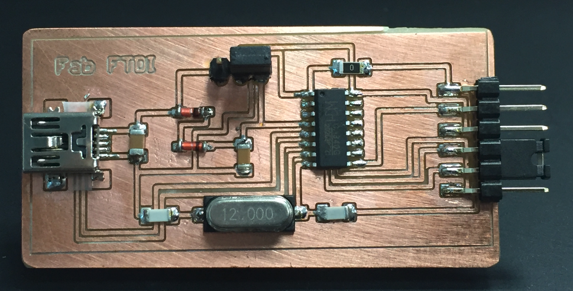
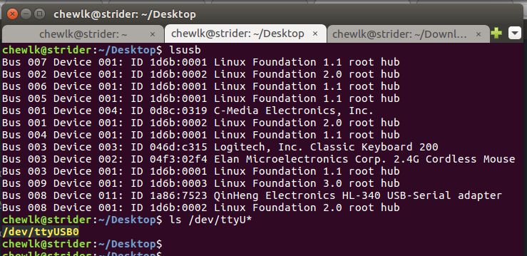
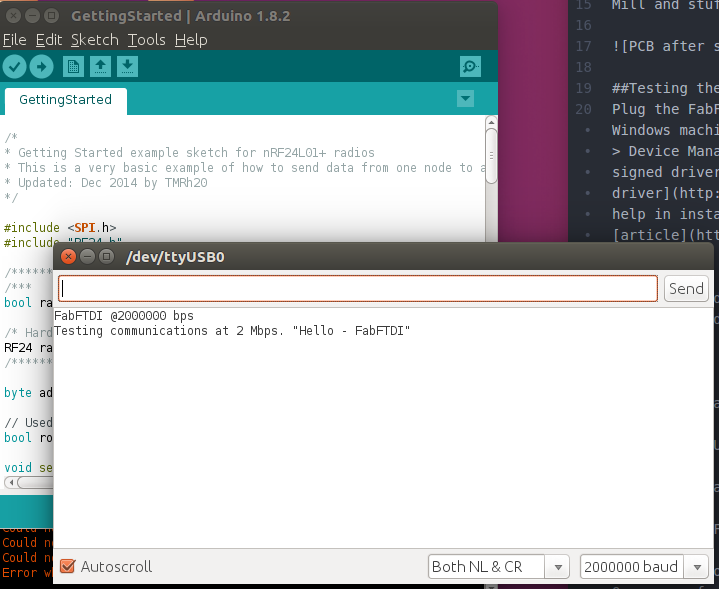

## Fab FTDI (CH340g)

* CH340g-based Fab FTDI
* tested up to:
  * 2 Mbps on loopback
  * 250000 bps with esp8266
* RTS/CTS flow control

## Schematic & Board Layout

JP1 allows selection of 5V or 3.6V supply for FTDI interface

Board outline file for fab modules

Board traces file for fab modulles

Mill and stuff the PCB.

## Testing the Board

Plug the FabFTDI-CH340g board into your computer's USB port. On a Windows machine, look for the COMport under Control Panel > System > Device Manager. You may need to install the CH340g driver. A signed driver can be downloaded here --> [CH340g driver](http://www.arduined.eu/files/CH341SER.zip). If you need help in installing the CH340g driver, you can refer to this [article](http://www.arduined.eu/ch340g-converter-windows-7-driver-download/).

Linux PCs and MacBooks should be able to detect the FabFTDI board without any driver. To check the device port:

`lsusb`

should display *QinHeng Electronics HL-340 USB-Serial adapter*

`ls /dev/ttyU*`

should display the device port.

To perform loopback test on the board, jumper the TXD and RXD pins. Open your favorite terminal emulation software, e.g. Arduino IDE or picocom. Select the device port.

E.g. for Arduino IDE on Linux, select Tools > Port > /dev/ttyUSB0. Click Serial Monitor (**Ctrl+Shift+M**). Select *Both NL & CR*. Select the desired baud rate. Type a message on the transmit window and press **Enter** or click the **Send** button. You should see the message appearing on the received data window.

As stated at the start of this tutorial, I have tested the board up to 2 Mbps on loopback and 115200 bps on an ESP8266 module.

Good luck and have fun with your FabFTDI board!

## Files

[Eagle Schematic](files/ch340g/fabftdi-ch340g.sch)

[Eagle PCB layout](files/ch340g/fabftdi-ch340g.brd)

*Copyright (c) 2017-Steven Chew*

*MIT license*
