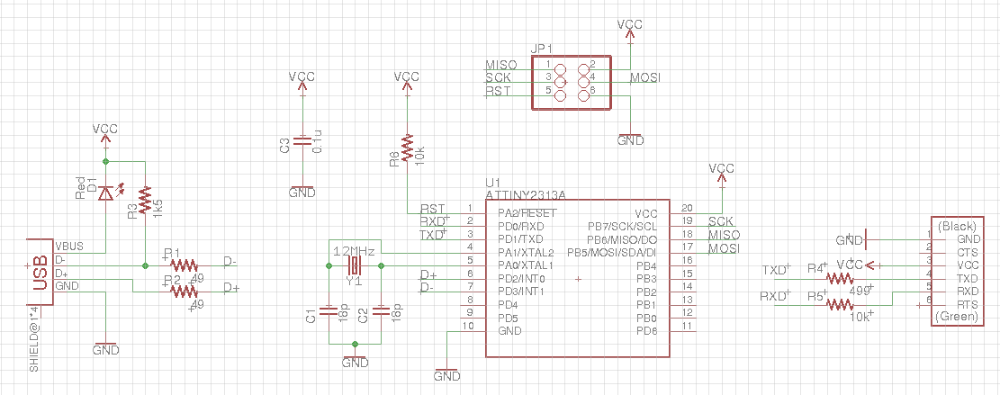
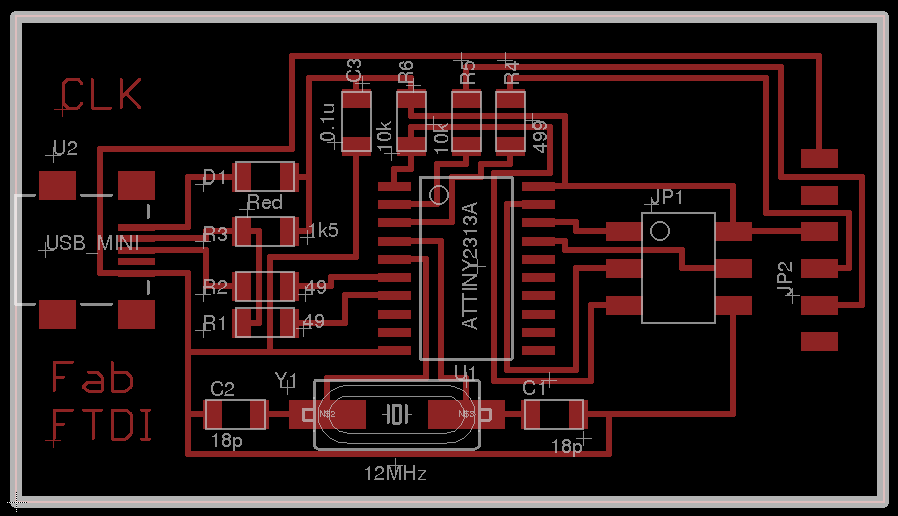
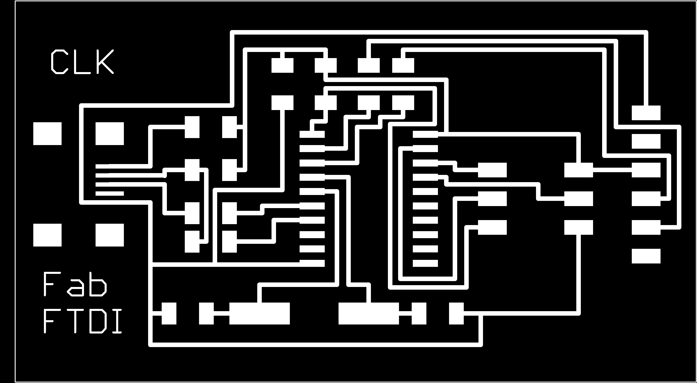
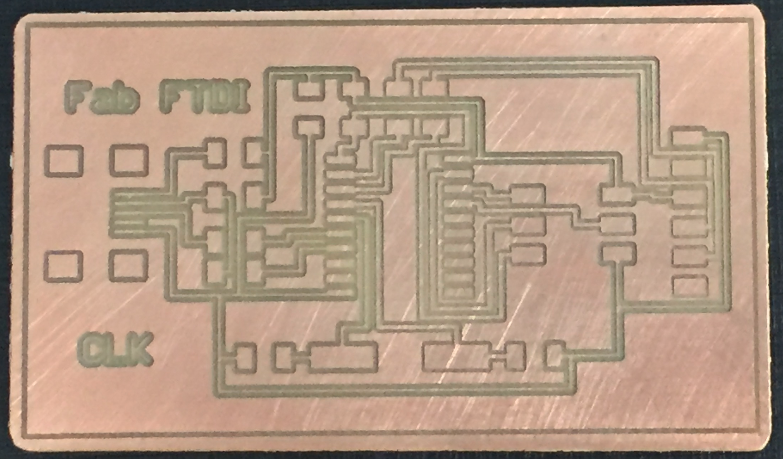
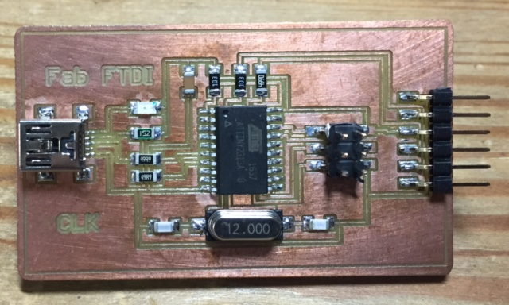
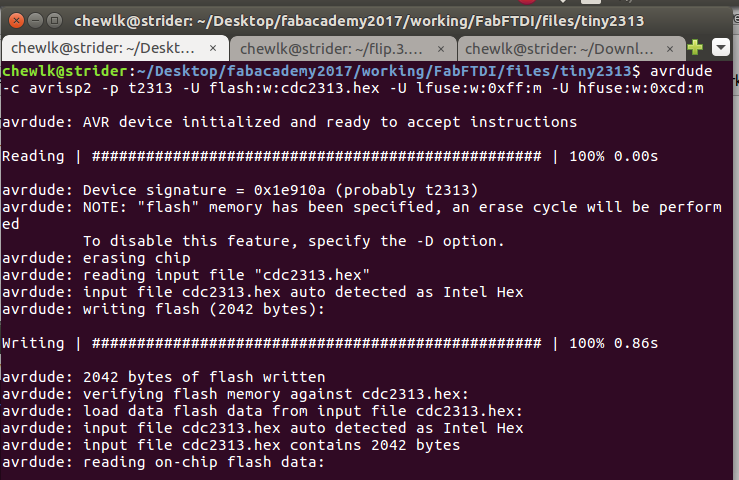
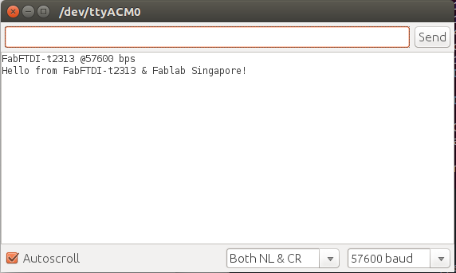

##FabFTDI - ATtiny2313

* ATtiny2313-based Fab FTDI
* hardware UART
* tested up to:
  * 57600 bps on loopback
* uses v-USB library
  * AVR-CDE from [Recursion.jp](http://www.recursion.jp/prose/avrcdc/)

##Schematic & Board Layout



I opted to use a 12 MHz crystal in my design because I had some handy (bought for my CH340g-based FabFTDI). Also, the ***compiled .hex file is for an ATtiny2313 with 12 MHz crystal.***. If you are using a different crystal oscillator, you will need to recompile the program from [source](http://www.recursion.jp/prose/avrcdc/download.html).

The FTDI Vcc is 3.6V, obtained by dropping the USB 5V through an LED. This means that it can work directly with 3.3V-based systems like the ESP8266 or ATxmega16E5. If you are interfacing with 5V boards, **do not connect the FTDI Vcc to the target Vcc**, as I have not implemented 3.6V zeners for the USB D+ and D= lines.




Fab modules - board outline



Fab modules - board traces

Mill and stuff the PCB





##Programming the Fab FTDI board

Unlike the CH340g-based FabFTDI, the ATmega8-based FabFTDI board uses the V-USB software library to implement USB-to-TTL conversion, i.e. it has to be programmed with the correct firmware before it can be used.

You need both an ISP programmer like the [FabISP](http://docs.academany.org/FabAcademy-Tutorials/_book/en/week4_electronic_production/fabisp.html) and [avrdude](http://savannah.nongnu.org/projects/avrdude) to program the FabFTDI-mega8 board. Instructions for installing avrdude can be found in the Fab Academy [tutorials](http://docs.academany.org/FabAcademy-Tutorials/_book/en/week4_electronic_production/fabisp.html) page. If you are using a different speed crystal oscillator, you will need to re-compile the firmware from [source](http://www.recursion.jp/prose/avrcdc/download.html).

Download the [FabFTDI-t2313 firmware](files/tiny2313/cdc2313.hex).

Flash the firmware onto the FabFTDI-t2313 board using avrdude:

`avrdude -c usbtiny -p t2313 -U flash:w:cdctiny2313.hex -U lfuse:w:0xff:m -U hfuse:w:0xcd:m`



If you have managed to successfully flash the firmware onto the FabFTDI-t2313 board, give yourself a **pat** on the back. You are almost home.

## Testing the Board

Plug the FabFTDI-t2313 board into your computer's USB port. Your computer should recognise the FabFTDI-t2313 board directly, as it implements the HIDinterface protocol.

On Windows machines, look for the COMport under Control Panel > System > Device Manager. On Linux or OSX machines, type the commands:
```
lsusb
ls /dev/ttyACM*
```
The FabFTDI-t2313 should appear as ***ID 16c0:05e1 Van Ooijen Technische Informatica Free shared USB VID/PID pair for CDC devices*** and ***/dev/ttyACM0***

To perform loopback test on the FabFTDI-mega8 board, jumper the TXD and RXD pins. Open your favorite terminal emulation software, e.g. Arduino IDE or picocom. Select the device port.

E.g. for Arduino IDE on Linux, select Tools > Port > /dev/ttyACM0. Click Serail Monitor (**Ctrl+Shift+M**). Select *Both NL & CR*. Select the desired baud rate. Type a message on the transmit window and press **Enter** or click the **Send** button. You should see the message appearing ont the received data window.



As stated at the start of this tutorial, I have tested the FabFTDI-t2313 board up to 57600 bps on loopback only.

Good luck and have fun with your FabFTDI board!

## Files

[Eagle Schematic](files/tiny2313/fabftdi-t2313.sch)

[Eagle PCB layout](files/tiny2313/fabftdi-t2313.brd)

[FabFTDI-t2313 firmware (12MHz crystal)](files/tiny2313/cdc2313.hex)

[FabFTDI-t2313 firmware (16MHz crystal)](files/tiny2313/cdc2313-16.hex)

[FabFTDI-t2313 firmware (20MHz crystal)](files/tiny2313/cdc2313-20.hex)

*Copyright (c) Steven Chew*...

*MIT license*
